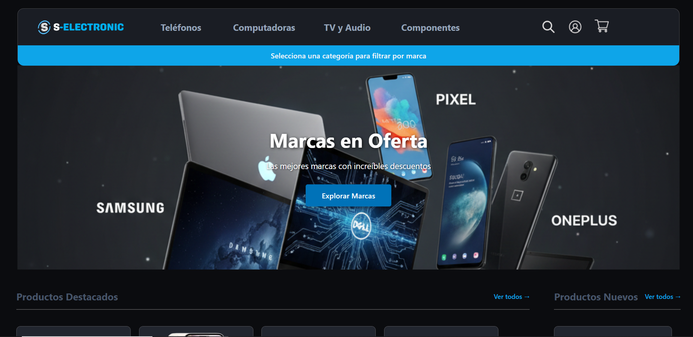
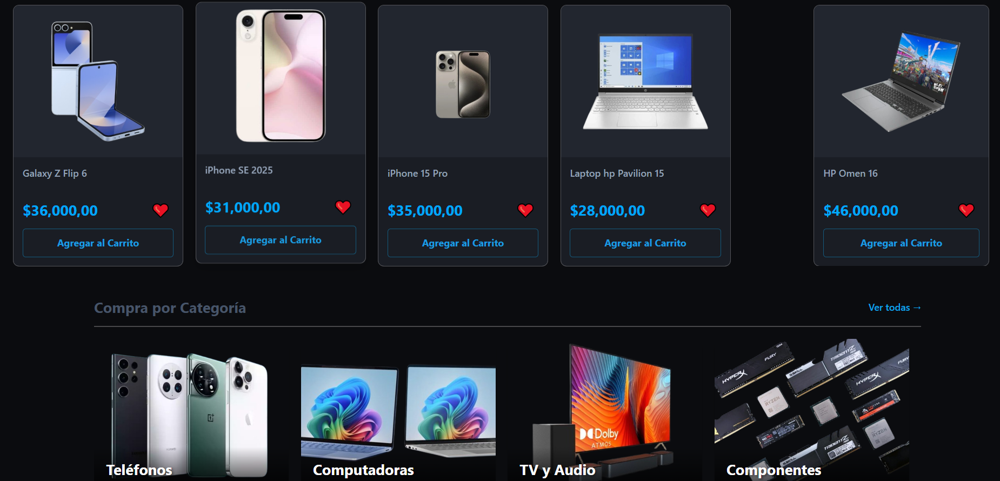
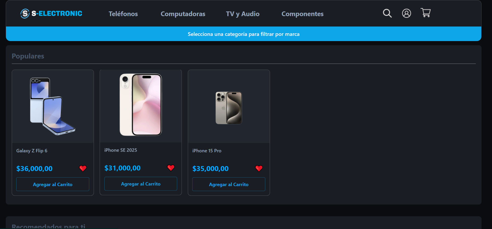
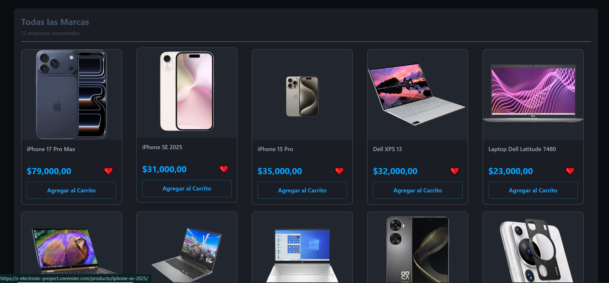
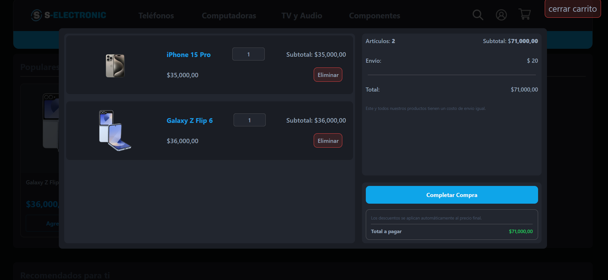
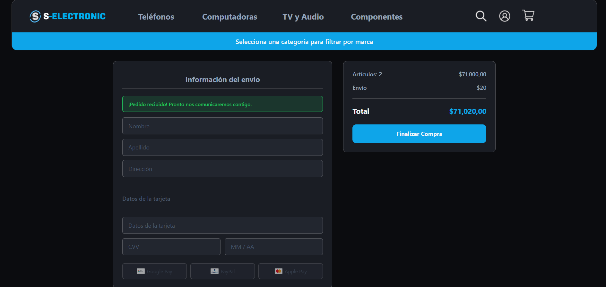

# S-electronic-Proyect
Plataforma de comercio electrónico desarrollada con Django y PostgreSQL.

## 📖 Descripción

S-ELECTRONIC es una plataforma de e-commerce desarrollada en Django que permite
la venta de productos electrónicos. Ofrece un sistema completo de gestión de 
inventario, carrito de compras, y procesamiento de órdenes.

## ✨ Características

- 🛒 Carrito de compras con actualización en tiempo real
- 📦 Gestión de inventario por categorías y marcas
- 💳 Sistema de descuentos automáticos
- 🔍 Búsqueda y filtrado de productos
- 📊 Panel de administración personalizado
- 🎨 Interfaz responsive y moderna

## 📸 Capturas de Pantalla
 - pagina principal
 - pagina principal
 - categoria/telefonos
 - marcas
 - carrito
 - checkout

### Página Principal
La página principal (Home) esta diseñada bajo un enfoque dinámico basado en secciones. Esto significa que el contenido no es estático, sino que se organiza en bloques que pueden variar según la interacción del usuario y la lógica del sistema. Estas secciones pueden representar categorías principales, productos destacados, ofertas u otros conjuntos de información relevantes.

El comportamiento dinámico del Home permite que, dependiendo de la navegación del usuario o de ciertas condiciones definidas en el backend, se muestren diferentes conjuntos de datos, mejorando así la experiencia de usuario y la personalización del contenido. Esta estructura también facilita la escalabilidad del sistema, ya que nuevas secciones pueden ser añadidas, modificadas u ocultadas sin necesidad de alterar la arquitectura general de la página.

### Carrito de Compras
El carrito de compras es un sistema inteligente que permite a los usuarios agregar y gestionar productos antes de realizar la compra. Funciona de manera dual:

Para usuarios anónimos: Los productos se almacenan en la sesión del navegador
Para usuarios autenticados: Los productos se guardan en la base de datos para persistencia entre sesiones

**Funcionalidades**
- Agregar productos: Añade artículos con cantidad especificada
- Actualizar cantidades: Modifica dinámicamente la cantidad de cada producto
- Eliminar productos: Quita artículos del carrito
- Limpiar carrito: Vacía todos los productos de una vez

**Sistema de Descuentos**
- Descuentos por producto: Ofertas individuales
- Descuentos por marca: Promociones de categoría de marca
- Descuentos por categoría: Promociones de categoría de producto
- Muestra el ahorro total antes de proceder al checkout


## 🛠️ Tecnologías

**Backend:**
- Python 3.13.12
- Django 5.2.5
- PostgreSQL

**Frontend:**
- HTML5, CSS3, JavaScript (Vanilla)
- FontAwesome para iconos

**Otros:**
- Git para control de versiones

## 📋 Prerequisitos

Antes de comenzar, asegúrate de tener instalado:

- Python 3.11 o superior
- PostgreSQL 14+
- pip (gestor de paquetes de Python)
- Virtualenv (recomendado)

## 🚀 Instalación

### 1. Clonar el repositorio
```bash
git clone https://github.com/carlosmartinez050/S-electronic-Proyect.git
cd S-ELECTRONIC (PROYECT)
```

### 2. Crear entorno virtual
```bash
python -m venv virtualenv
source virtualenv/bin/activate  # En Windows: virtualenv\Scripts\activate
```

### 3. Instalar dependencias
```bash
pip install -r requirements.txt
```

### 4. Configurar base de datos
```bash
# Crear base de datos en PostgreSQL
createdb S-electronic

# Configurar .env (ver .env.example)
cp .env.example .env
```

### 5. Ejecutar migraciones
```bash
python manage.py migrate
```

### 6. Crear superusuario
```bash
python manage.py createsuperuser
```

### 7. Ejecutar servidor
```bash
python manage.py runserver
```

### 8. Acceder a la aplicación
Abre tu navegador en: http://localhost:8000

## ⚙️ Configuración

Crea un archivo `.env` en la raíz del proyecto:
```env
# Base de datos
DATABASE_NAME=S-electronic
DATABASE_USER=postgres
DATABASE_PASSWORD=tu_contraseña
DATABASE_HOST=localhost
DATABASE_PORT=5432

# Django
SECRET_KEY=tu-clave-secreta-aqui
DEBUG=True
ALLOWED_HOSTS=localhost,127.0.0.1
```

## 💡 Uso

### Acceder al panel de administración
1. Navega a http://localhost:8000/admin
2. Ingresa con el superusuario creado
3. Gestiona productos, categorías, órdenes y descuentos

### Agregar productos
1. En el admin, ve a "Productos" → "Agregar producto"
2. Completa los campos requeridos
3. Asigna categoría y marca
4. Guarda

### Ver tienda
1. Navega a https://s-electronic-proyect.onrender.com
2. Explora productos por categoría
3. Agrega al carrito
4. Finaliza compra

## 📂 Estructura del Proyecto
AQUI

## 🗺️ Roadmap

- [ ] calificaciones a Productos

## 🤝 Contribución

Las contribuciones son bienvenidas. Por favor:

1. Fork el proyecto
2. Crea una rama para tu feature (`git checkout -b feature/NuevaCaracteristica`)
3. Commit tus cambios (`git commit -m 'Agregar nueva característica'`)
4. Push a la rama (`git push origin feature/NuevaCaracteristica`)
5. Abre un Pull Request

## 👥 Autores

- **Carlos Martinez** - *Desarrollo Principal* - [GitHub](https://github.com/carlosmartinez050)

## 📧 Contacto

- Email: tu-email@ejemplo.com
- LinkedIn: [Tu Perfil](https://linkedin.com/in/tu-perfil) # PROXIMAMENTE 
- Website: [tuportfolio.com](https://tuportfolio.com)      # PROXIMAMENTE

## 📄 Licencia

Este proyecto está bajo la Licencia MIT. Consulta el archivo [LICENSE](LICENSE) para más detalles.


